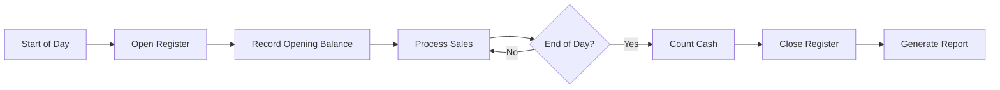

## Overview

Cash register operations (Corte de Caja) ensure accurate financial tracking by requiring opening balances, tracking all transactions throughout the day, and reconciling cash, card, and transfer payments at closing.

## Prerequisites

- Permission: `ventas.pos` (Use POS)
- Access to POS system
- Physical cash register key (if applicable)

## Daily Cash Register Flow



## Opening the Cash Register

<Steps>

### Access POS System

Navigate to `/pos` at the start of your shift.

### Enter Opening Balance (Fondo Inicial)

If no opening balance is registered for today, a modal automatically appears:

1. Count physical cash in the register
2. Enter the amount in the **Fondo Inicial** field
3. Click **"Confirmar"** to save

```javascript
await registrarAperturaCaja(fondoInicialCaja, {
  uid: auth.currentUser?.uid,
  email: auth.currentUser?.email,
  nombre: auth.currentUser?.displayName
});
```

### Corte de Caja Record Created

The system creates a daily record:

```javascript
{
  fechaKey: "2026-03-06",           // YYYY-MM-DD format
  fondoInicialCaja: 500.00,         // Opening balance
  cajero: {
    uid: "user-123",
    email: "cajero@example.com",
    nombre: "Juan Pérez"
  },
  aperturaEn: Timestamp,            // Opening timestamp
  cerrado: false                     // Not closed yet
}
```

See: `src/js/services/corte_caja_firestore.js:94-109`

</Steps>

<Warning>
The POS is completely blocked until opening balance is registered. No sales, searches, or cart operations are permitted.
</Warning>

## During the Day

### Sales Are Tracked Automatically

Every POS sale is recorded in the `ventas` collection:

```javascript
{
  id: "venta-123",
  clienteTelefono: "5551234567",
  subtotal: 850.00,
  iva: 136.00,
  total: 986.00,
  tipoPago: "efectivo",
  pagoDetalle: {
    efectivo: 1000.00,
    tarjeta: 0,
    transferencia: 0
  },
  fecha: Timestamp,
  productos: [...]
}
```

### Payment Method Tracking

The system categorizes payments:

- **Efectivo**: Cash payments
- **Tarjeta**: Card payments (requires reference number)
- **Transferencia**: Bank transfers
- **Mixed**: Combination of methods

```javascript
const resumen = {
  efectivo: 0,
  tarjeta: 0,
  transferencia: 0,
  otros: 0
};

ventasDia.forEach((v) => {
  const detalle = v?.pagoDetalle || {};
  const tipo = String(v?.tipoPago || "").toLowerCase().trim();
  
  resumen.efectivo += Number(detalle?.efectivo || 0);
  resumen.tarjeta += Number(detalle?.tarjeta || 0);
  resumen.transferencia += Number(detalle?.transferencia || 0);
});
```

See: `src/js/services/corte_caja_firestore.js:26-75`

### Cash Withdrawals & Expenses

Two types of cash outflows are tracked:

**1. Retiros (Withdrawals during closing)**
```javascript
{
  tipo: "retiro",
  monto: 500.00,
  motivo: "Depósito bancario",
  usuario: "Juan Pérez",
  origen: "arqueo"
}
```

**2. Egresos Diarios (Daily Expenses)**
```javascript
{
  id: "egreso-456",
  tipo: "otro",
  monto: 150.00,
  descripcion: "Compra papelería",
  usuario: "Juan Pérez",
  origen: "egresos_diarios"
}
```

Both are consolidated as `salidasCaja` during closing.

## Closing the Cash Register

<Steps>

### Navigate to Cash Closing

From the reports or configuration menu, access **"Cerrar Caja"** or **"Corte de Caja"**.

### Review Daily Summary

The system displays:

- **Tickets Sold**: Count of transactions
- **Subtotal**: Sum before tax
- **IVA**: Total tax collected
- **Total**: Grand total
- **Payment Breakdown**:
  - Efectivo: Cash received
  - Tarjeta: Card payments
  - Transferencia: Transfers

### Count Physical Cash

Two methods to record cash count:

**Method 1: Denomination Count**

Enter quantity of each denomination:

```javascript
denominaciones: [
  { valor: 1000, cantidad: 5 },   // 5 × $1000 = $5000
  { valor: 500, cantidad: 3 },    // 3 × $500 = $1500
  { valor: 200, cantidad: 10 },   // 10 × $200 = $2000
  { valor: 100, cantidad: 8 },    // 8 × $100 = $800
  { valor: 50, cantidad: 4 },     // 4 × $50 = $200
  // ... coins
]

const efectivoDenominaciones = denominaciones.reduce(
  (acc, d) => acc + (d.valor * d.cantidad),
  0
);
```

**Method 2: Total Count**

Simply enter total cash counted:

```javascript
efectivoContado: 9500.00
```

### Record Withdrawals

Enter any cash removed during closing:

```javascript
retiros: [
  {
    tipo: "retiro",
    monto: 5000.00,
    motivo: "Depósito bancario",
    usuario: "Juan Pérez"
  },
  {
    tipo: "retiro",
    monto: 1000.00,
    motivo: "Fondo para cambio mañana",
    usuario: "Juan Pérez"
  }
]
```

### System Calculates Reconciliation

```javascript
const cajaFinalEsperada = 
  fondoInicialCaja +        // Opening balance
  resumen.efectivo -        // Cash sales
  totalRetiros;             // Withdrawals

const diferencia = efectivoContado - resumen.efectivo;
```

**Reconciliation Scenarios:**

- **diferencia = 0**: Perfect match
- **diferencia > 0**: Cash overage (more than expected)
- **diferencia < 0**: Cash shortage (less than expected)

<Note>
Small variances (±$5) are normal due to rounding. Larger discrepancies should be investigated.
</Note>

### Add Closing Notes (Optional)

```javascript
notasCorte: "Faltaron $20 en billetes de $500. Cliente regresó a pagar pendiente."
```

### Confirm Cash Closing

Click **"Cerrar Caja"** to finalize:

```javascript
await cerrarCajaHoy(ventasDia, {
  fondoInicialCaja,
  efectivoContado,
  denominaciones,
  retiros,
  egresos,
  notasCorte,
  cajero: {
    uid: auth.currentUser?.uid,
    email: auth.currentUser?.email,
    nombre: auth.currentUser?.displayName
  }
});
```

### Register Closed

The corte record is updated:

```javascript
{
  fechaKey: "2026-03-06",
  cerrado: true,
  cerradoEn: Timestamp,
  cajero: {...},
  resumen: {
    subtotal: 15240.00,
    iva: 2438.40,
    total: 17678.40,
    tickets: 23,
    efectivo: 9500.00,
    tarjeta: 6178.40,
    transferencia: 2000.00,
    unidades: 47
  },
  fondoInicialCaja: 500.00,
  cajaFinalEsperada: 4500.00,
  conteoEfectivo: {
    esperado: 9500.00,
    contado: 9480.00,
    diferencia: -20.00
  },
  denominaciones: [...],
  retiros: [...],
  totalRetiros: 5500.00,
  notasCorte: "...",
  ventasIds: ["venta-1", "venta-2", ...]
}
```

See: `src/js/services/corte_caja_firestore.js:116-229`

</Steps>

## After Closing

### POS Becomes Blocked

Once closed for the day:

```javascript
if (cajaCerradaHoy) {
  return (
    <div className="caja-cerrada-alert">
      Caja cerrada hoy. No se pueden registrar ventas hasta mañana.
      {formatoCierre ? ` Cierre: ${formatoCierre}.` : ""}
    </div>
  );
}
```

- All sales operations disabled
- Cart is cleared
- Search field disabled
- Display shows closing timestamp

### Generate Closing Report

The system can generate PDF reports (see `src/js/services/pdf_corte_caja.js`) with:

- Opening/closing balances
- Sales summary by payment method
- Cash reconciliation
- Withdrawal details
- Denominations breakdown
- Cashier information

### Next Day Automatic Reset

At midnight or on first POS access of new day:

1. Previous day's `fechaKey` no longer matches
2. System requests new opening balance
3. New corte de caja record created
4. Sales operations resume

## Automatic Closure of Old Registers

The system includes auto-close functionality:

```javascript
export async function autoCerrarCortesPendientes() {
  const hoyKey = getDateKeyLocal();
  
  // Find all dates with sales but no closed register
  const ventasPorFecha = new Map();
  ventas.forEach((v) => {
    const key = getDateKeyLocal(toDate(v.fecha));
    if (!ventasPorFecha.has(key)) ventasPorFecha.set(key, []);
    ventasPorFecha.get(key).push(v);
  });
  
  // Close registers for past dates
  for (const [fechaKey, ventasDia] of ventasPorFecha.entries()) {
    if (fechaKey >= hoyKey) continue;  // Skip today
    const corte = cortesMap.get(fechaKey);
    if (corte?.cerrado) continue;      // Already closed
    
    // Auto-close with system flag
    const resumen = calcularResumenVentasDia(ventasDia);
    await setDoc(doc(db, "cortes_caja", fechaKey), {
      fechaKey,
      cerrado: true,
      cerradoEn: serverTimestamp(),
      cerradoPorSistema: true,        // Automatic closure
      resumen,
      // ... other fields
    });
  }
}
```

See: `src/js/services/corte_caja_firestore.js:238-296`

<Warning>
Auto-closed registers lack cash count and reconciliation data. They should be reviewed manually and updated with actual closing information.
</Warning>

## Viewing Historical Registers

```javascript
export async function listarCortesCaja() {
  const snap = await getDocs(collection(db, "cortes_caja"));
  return snap.docs
    .map((d) => ({ id: d.id, ...d.data() }))
    .sort((a, b) => 
      String(b.fechaKey || "").localeCompare(String(a.fechaKey || ""))
    );
}
```

Access from Reports module to view:
- All historical closings
- Revenue trends
- Payment method breakdowns
- Cashier performance
- Cash variances over time

## Best Practices

<CardGroup cols={2}>
  <Card title="Accurate Opening Count" icon="calculator">
    Always count opening balance carefully. Errors propagate throughout the day.
  </Card>
  
  <Card title="Close Daily" icon="calendar-check">
    Never leave registers open overnight. Close at end of each business day.
  </Card>
  
  <Card title="Two-Person Count" icon="users">
    Have two employees verify cash counts for amounts over $10,000.
  </Card>
  
  <Card title="Document Variances" icon="file-lines">
    Use notasCorte to explain any cash differences for audit trail.
  </Card>
</CardGroup>

## Troubleshooting

**Can't access POS - "Captura el fondo inicial"?**
- Opening balance not registered for today
- Enter the cash currently in register
- If second shift, use expected amount from previous closure

**Register shows as closed but it's still business hours?**
- Someone closed it early by mistake
- Contact administrator to reopen
- May require database update to set `cerrado: false`

**Cash variance is large (>$100)?**
- Recount physical cash
- Verify all sales were properly recorded in POS
- Check for unrecorded withdrawals or expenses
- Review transaction history for errors
- Document findings in notasCorte

**"Caja cerrada" message appears tomorrow?**
- Should auto-reset based on fechaKey
- Verify system date/time is correct
- Clear browser cache and reload
- Check if corte exists for today's date in database

**Auto-closed register missing cash count?**
- System closed it overnight automatically
- Edit the corte record manually in Firestore
- Add denominaciones and efectivoContado
- Or note it was not physically reconciled

## Multi-Cashier Environments

<Note>
If multiple cashiers use the same register:
- Opening balance is shared
- Each cashier's sales are tracked separately by user
- Closing should be done by last cashier of the day
- Consider shift reports if needed between cashier changes
</Note>

## Related Workflows

- [Processing Sales](/guides/processing-sales) - Using POS during open register
- [Permissions & Roles](/guides/permissions-roles) - Understanding the `ventas.pos` permission